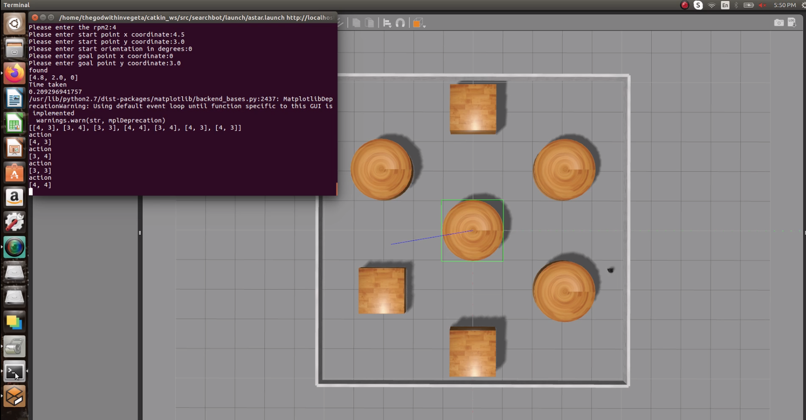

# A* Path Planning-implementation on TurtleBot-ROS|Python

[](https://opensource.org/licenses/MIT)
---

## Overview - A Python implemntation for A* Path Planning algorithm

TurtleBot is a low-cost, personal robot kit with open-source software. TurtleBot was created at Willow Garage by Melonee Wise and Tully Foote in November 2010. With TurtleBot, you’ll be able to build a robot that can drive around your house, see in 3D, and have enough horsepower to create exciting applications.
The github repository implements a software for path planning that aids a TurtleBot robot in the autonomous navigation. This is developed using Python for (A fictional situation for the ENPM661 Project3). 

A* Path planning algorithm is very effective for known environment. 

The algorithm is similar to Djikstra's algorithm except for the fact that the total cost is a combination of cost/distance of the current node to the start node (Path cost) and current node to the goal node (heuristic cost). In this implementation I am assuming the robot can travel only in 4 directions, namely North, East, South and West. The path cost of traveling to an adjacent node in the above mentioned direction is set to 1. The Heuristic cost is calculated by the straight line distance between the current node and the goal node. 

The total cost is calculated as a combination of path cost + 0.1 * heusristic cost.

A weight of 0.1 is multiplied to the heuristic cost to prevent this cost from over powering the total cost (it the becomes similar to greedy best search).

Features:

A user a input a warehouse map during run time to run the the path planning calculations. The warehouse map is inputed as a .csv file. The obstacles are represented as a '0' in the cell and the other cells are represented by 1.
The below image represents the excel file. The excel file is later exported as a .csv file.


The user then inputs the start and end nodes for calculation.

<p align="center"></p>

Once the user inputs the start and end nodes the software calculates the shortest path between the two nodes. The below picture shows the visual of the selected path. 


## License
```
MIT License

Copyright (c) 2020 Arjun Srinivasan Ambalam

Permission is hereby granted, free of charge, to any person obtaining a copy
of this software and associated documentation files (the "Software"), to deal
in the Software without restriction, including without limitation the rights
to use, copy, modify, merge, publish, distribute, sublicense, and/or sell
copies of the Software, and to permit persons to whom the Software is
furnished to do so, subject to the following conditions:

The above copyright notice and this permission notice shall be included in all
copies or substantial portions of the Software.

THE SOFTWARE IS PROVIDED "AS IS", WITHOUT WARRANTY OF ANY KIND, EXPRESS OR
IMPLIED, INCLUDING BUT NOT LIMITED TO THE WARRANTIES OF MERCHANTABILITY,
FITNESS FOR A PARTICULAR PURPOSE AND NONINFRINGEMENT. IN NO EVENT SHALL THE
AUTHORS OR COPYRIGHT HOLDERS BE LIABLE FOR ANY CLAIM, DAMAGES OR OTHER
LIABILITY, WHETHER IN AN ACTION OF CONTRACT, TORT OR OTHERWISE, ARISING FROM,
OUT OF OR IN CONNECTION WITH THE SOFTWARE OR THE USE OR OTHER DEALINGS IN THE
SOFTWARE.
```

## Product Backlog and Sprint Schedule

Please vist the link at:

https://docs.google.com/a/terpmail.umd.edu/spreadsheets/d/12z8tL9RKelgzJ8GJdyQ-GIjZYogpATpe3jIa_0ffNng/edit?usp=sharing

## Install OpenCV
Installation can be done using the following website:

https://docs.opencv.org/2.4/doc/tutorials/introduction/linux_install/linux_install.html?

1. Create a temporary directory, which we denote as <cmake_binary_dir>, where you want to put the generated Makefiles, project files as well the object files and output binaries.

2. Enter the <cmake_binary_dir> and type
```
cmake [<some optional parameters>] <path to the OpenCV source directory>
```
for example
```
cd ~/opencv
mkdir release
cd release
cmake -D CMAKE_BUILD_TYPE=RELEASE -D CMAKE_INSTALL_PREFIX=/usr/local ..
```

3. Enter the created temporary directory (<cmake_binary_dir>) and proceed with:

```
make
sudo make install
```
## Standard install via command-line (How to Build)
```
git clone --recursive https://github.com/senthilarul/Midterm-APathPlanning.git
cd <path to repository>
mkdir build
cd build
cmake ..
make
Run tests: ./test/cpp-test
Run program: ./app/shell-app
```

## Building for code coverage
```
sudo apt-get install lcov
cmake -D COVERAGE=ON -D CMAKE_BUILD_TYPE=Debug ../
make
make code_coverage
```
This generates a index.html page in the build/coverage sub-directory that can be viewed locally in a web browser.

## Working with Eclipse IDE ##

## Installation

In your Eclipse workspace directory (or create a new one), checkout the repo (and submodules)
```
mkdir -p ~/workspace
cd ~/workspace
git clone --recursive https://github.com/senthilarul/Midterm-APathPlanning.git
```

In your work directory, use cmake to create an Eclipse project for an [out-of-source build] of Midterm-APathPlanning

```
cd ~/workspace
mkdir -p astar-eclipse
cd astar-eclipse
cmake -G "Eclipse CDT4 - Unix Makefiles" -D CMAKE_BUILD_TYPE=Debug -D CMAKE_ECLIPSE_VERSION=4.7.0 -D CMAKE_CXX_COMPILER_ARG1=-std=c++14 ../Midterm-APathPlanning/
```

## Import

Open Eclipse, go to File -> Import -> General -> Existing Projects into Workspace -> 
Select "astar-eclipse" directory created previously as root directory -> Finish

# Edit

Source files may be edited under the "[Source Directory]" label in the Project Explorer.


## Build

To build the project, in Eclipse, unfold astar-eclipse project in Project Explorer,
unfold Build Targets, double click on "all" to build all projects.

## Run

1. In Eclipse, right click on the astar-eclipse in Project Explorer,
select Run As -> Local C/C++ Application

2. Choose the binaries to run (e.g. shell-app, cpp-test for unit testing)


## Debug


1. Set breakpoint in source file (i.e. double click in the left margin on the line you want 
the program to break).

2. In Eclipse, right click on the astar-eclipse in Project Explorer, select Debug As -> 
Local C/C++ Application, choose the binaries to run (e.g. shell-app).

3. If prompt to "Confirm Perspective Switch", select yes.

4. Program will break at the breakpoint you set.

5. Press Step Into (F5), Step Over (F6), Step Return (F7) to step/debug your program.

6. Right click on the variable in editor to add watch expression to watch the variable in 
debugger window.

7. Press Terminate icon to terminate debugging and press C/C++ icon to switch back to C/C++ 
perspetive view (or Windows->Perspective->Open Perspective->C/C++).


## Plugins

- CppChEclipse

    To install and run cppcheck in Eclipse

    1. In Eclipse, go to Window -> Preferences -> C/C++ -> cppcheclipse.
    Set cppcheck binary path to "/usr/bin/cppcheck".

    2. To run CPPCheck on a project, right click on the project name in the Project Explorer 
    and choose cppcheck -> Run cppcheck.


- Google C++ Sytle

    To include and use Google C++ Style formatter in Eclipse

    1. In Eclipse, go to Window -> Preferences -> C/C++ -> Code Style -> Formatter. 
    Import [eclipse-cpp-google-style][reference-id-for-eclipse-cpp-google-style] and apply.

    2. To use Google C++ style formatter, right click on the source code or folder in 
    Project Explorer and choose Source -> Format

[reference-id-for-eclipse-cpp-google-style]: https://raw.githubusercontent.com/google/styleguide/gh-pages/eclipse-cpp-google-style.xml

- Git

    It is possible to manage version control through Eclipse and the git plugin, but it typically requires creating another project. If you're interested in this, try it out yourself and contact me on Canvas.

## Doxygen 

To install Doxygen

```
sudo apt install doxygen
```

once the installation is over we can generate the Doxygen documentation by running
```
doxygen ./Doxygen
```

## Demo 

To run the demo naviagate to the project directory and enter:
```
cd build
./app/shell-app
```

The demo runs and gives the user 2 option.
1) to use a default map
2) to upload a new map

if the user is uploading a new map they have to enter the full path of the map. Also, the map should be in .csv format. The details regarding developing a .csv file for the map has been discussed earlier.

After the user inputs a map, the map is displays as a combination of numbers and 'X'. The 'X' denote a obstacle, while the number denote the traversable nodes. The user can input the start node from which the robot starts as well as the end node to which it must reach. The software calculates the shortest path and displays the selected path as a openCV diagram.
